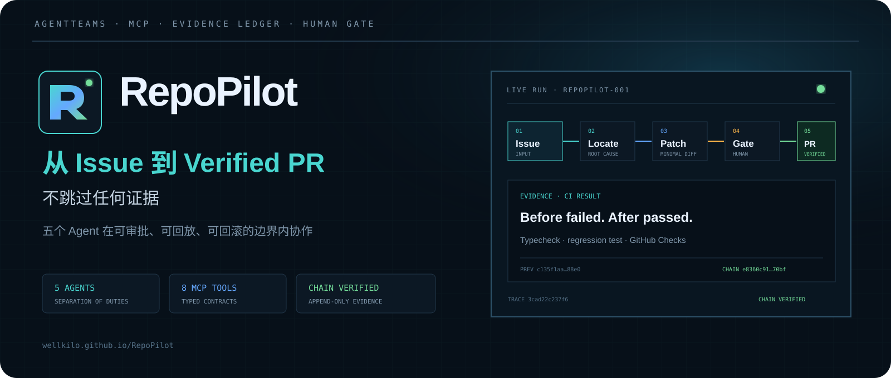
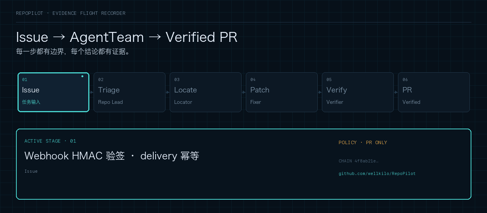
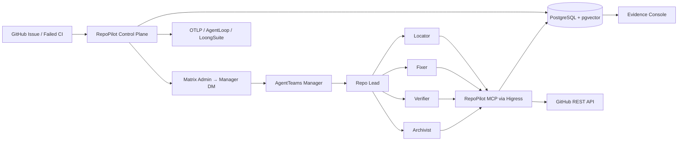

<div align="center">
  <a href="https://wellkilo.github.io/RepoPilot/">
    
  </a>
  <br /><br />
  <p><strong>面向开源与企业研发团队的可审计仓库自治维护 AgentTeam</strong></p>
  <p>
    将 GitHub Issue 与失败 CI 安全推进到经过独立验证的 Pull Request，
    并完整保留决策、工具、审批、回滚点与经验证据。
  </p>
  <br />
</div>

<a href="https://wellkilo.github.io/RepoPilot/">
  
</a>

<br />

<div align="center">
  <p>
    <a href="https://wellkilo.github.io/RepoPilot/">
      
    </a>
    <a href="https://github.com/wellkilo/RepoPilot/actions/workflows/ci.yml">
      
    </a>
    <a href="LICENSE">
      
    </a>
    <a href="https://github.com/agentscope-ai/AgentTeams/releases/tag/v1.2.2">
      
    </a>
    
    
  </p>
  <p>
    <a href="https://wellkilo.github.io/RepoPilot/">项目网站</a> ·
    <a href="https://wellkilo.github.io/RepoPilot/#demo">在线 Demo</a> ·
    <a href="#使用过程演示">流程演示</a> ·
    <a href="#快速开始">快速开始</a> ·
    <a href="docs/architecture.md">架构</a> ·
    <a href="API.md">API / MCP</a> ·
    <a href="docs/security.md">安全</a> ·
    <a href="docs/demo.md">Demo</a> ·
    <a href="competition/initial-submission.md">参赛材料</a>
  </p>
  <br />
</div>

<table>
  <tr>
    <td align="center"><strong>5</strong><br /><sub>不同职能 Agent</sub></td>
    <td align="center"><strong>8</strong><br /><sub>Streamable HTTP MCP 工具</sub></td>
    <td align="center"><strong>100%</strong><br /><sub>关键动作证据留痕</sub></td>
    <td align="center"><strong>0</strong><br /><sub>未审批自动合并</sub></td>
  </tr>
</table>

> RepoPilot 建立在 [AgentTeams](https://github.com/agentscope-ai/AgentTeams) `v1.2.2`
> 之上，面向 GOAI「新智基座 · Agent Infra」赛道设计。默认策略为
> `pull_request_only`：Agent 可以创建分支、提交和 Pull Request，但不能自动合并、
> 删除分支、修改权限或密钥。

## 使用过程演示

<div align="center">
  <a href="https://wellkilo.github.io/RepoPilot/#demo">
    
  </a>
  <p>
    <sub>
      Issue → Repo Lead 分诊 → Locator 定位 → Fixer 最小修复 → Verifier 独立验证 → Verified PR
    </sub>
  </p>
  <p>
    <a href="https://wellkilo.github.io/RepoPilot/#demo"><strong>回放真实 Issue → PR Run ↗</strong></a>
    ·
    <a href="https://wellkilo.github.io/RepoPilot/#loop">查看 8 阶段系统闭环</a>
    ·
    <a href="docs/assets/demo/repopilot-workflow.mp4">下载高清 MP4</a>
  </p>
</div>

> 在线 Demo 无需模型服务或管理员账号，基于真实 Run 回放 Issue 输入、根因定位、
> 一行补丁、GitHub Actions 验证、PR #2 与 16 条 Evidence。

## 维护闭环

<div align="center">

```text
GitHub Issue / Failed CI
          │
          ▼
   Repo Lead 分诊与拆解
          │
          ▼
 Locator 根因定位 ──► Fixer 最小修复 ──► Verifier 独立验证
                                                │
                  人工审批 ◄── 高风险门禁 ◄─────┤
                                                │
                                                ▼
                                      Archivist 沉淀 Runbook
```

</div>

每个关键阶段都会把决策、工具调用、Git 引用、CI 结果和审批事件写入
PostgreSQL 追加式 SHA-256 证据链，并通过 OpenTelemetry Trace 与证据控制台支持回放。

## 为什么是 RepoPilot

<table>
  <thead>
    <tr>
      <th>问题</th>
      <th>RepoPilot 的处理方式</th>
      <th>可验证证据</th>
    </tr>
  </thead>
  <tbody>
    <tr>
      <td>Issue 分诊依赖人工</td>
      <td>Repo Lead 统一分类、风险判断和 DAG 拆解</td>
      <td>任务计划、Matrix 事件、Run 状态</td>
    </tr>
    <tr>
      <td>自动修复容易直接猜答案</td>
      <td>Locator 与 Fixer 职责分离，先复现和证明根因</td>
      <td>复现命令、代码位置、影响面、补丁</td>
    </tr>
    <tr>
      <td>修复者自行验证存在偏差</td>
      <td>Verifier 独立运行 before/after 测试与 GitHub Checks</td>
      <td>测试结果、Check Runs、残余风险</td>
    </tr>
    <tr>
      <td>高风险动作缺少控制</td>
      <td>合并等动作要求带版本号的一次性人工审批</td>
      <td>审批人、意见、版本、消费时间</td>
    </tr>
    <tr>
      <td>经验无法复用</td>
      <td>Archivist 查重、脱敏并写入 Runbook</td>
      <td>来源 Run、证据链、检索结果</td>
    </tr>
  </tbody>
</table>

## AgentTeam

<table>
  <thead>
    <tr>
      <th width="18%">Agent</th>
      <th width="42%">职责</th>
      <th width="40%">自主边界</th>
    </tr>
  </thead>
  <tbody>
    <tr>
      <td><strong>Repo Lead</strong></td>
      <td>分诊、风险判断、DAG 拆解、任务委派</td>
      <td>不修改代码；高风险动作必须发起审批</td>
    </tr>
    <tr>
      <td><strong>Locator</strong></td>
      <td>复现、代码/符号定位、影响面分析</td>
      <td>仅读取和实验，不修改仓库</td>
    </tr>
    <tr>
      <td><strong>Fixer</strong></td>
      <td>最小补丁、回归测试、分支、提交、PR</td>
      <td>停在 Pull Request，不合并、不强推</td>
    </tr>
    <tr>
      <td><strong>Verifier</strong></td>
      <td>独立复现、测试、CI 和残余风险验证</td>
      <td>不修改补丁，不把绿灯视为合并授权</td>
    </tr>
    <tr>
      <td><strong>Archivist</strong></td>
      <td>Runbook 查重、脱敏、结构化和沉淀</td>
      <td>不修改仓库或 GitHub 状态</td>
    </tr>
  </tbody>
</table>

Agent Identity 完整定义位于
[`deploy/agentteams/repopilot-team.yaml`](deploy/agentteams/repopilot-team.yaml)，
Skill 契约位于 [`skills/`](skills/)。

## 核心能力

<details open>
  <summary><strong>AgentTeams 原生协作</strong></summary>
  <br />
  使用官方 <code>agentteams.io/v1beta1</code> Worker/Team CRD、Team Leader、
  Matrix 房间、共享任务状态与 MinIO 工作区，而不是自建多 Agent 模拟器。
</details>

<details>
  <summary><strong>Skill 与 MCP 工程化</strong></summary>
  <br />
  提供 5 个 Apache-2.0 自定义 Skill；控制面暴露 8 个 Streamable HTTP MCP 工具，
  覆盖 evidence、审批、Runbook、Issue、PR、Checks 和受控合并。
</details>

<details>
  <summary><strong>不可变执行证据</strong></summary>
  <br />
  Evidence 使用 canonical JSON 与 SHA-256 哈希链；数据库触发器拒绝更新和删除。
  控制台会重新验证完整链路并展示 <code>CHAIN VERIFIED</code>。
</details>

<details>
  <summary><strong>生产级安全边界</strong></summary>
  <br />
  包含 GitHub 仓库 allowlist、Webhook HMAC 验签、delivery 并发幂等、显式状态机、
  审批乐观锁和审批一次性消费。
</details>

<details>
  <summary><strong>RAG 与可观测</strong></summary>
  <br />
  PostgreSQL 提供 Runbook 全文检索并预留 pgvector；可选接入阿里云官方
  <code>alibabacloud-agentloop-experience</code> Skill。OpenTelemetry 通过 OTLP
  对接 AgentLoop、LoongSuite 或兼容后端。
</details>

## 系统架构



更多设计细节见 [`docs/architecture.md`](docs/architecture.md)。

## 工程结构

```text
RepoPilot/
├── apps/
│   ├── control-plane/       # Fastify REST / Webhook / MCP / 审批 / 证据账本
│   └── console/             # 飞行记录器风格 React 证据控制台
├── packages/contracts/      # Zod Schema、共享类型和显式状态机
├── deploy/agentteams/       # AgentTeams v1.2.2 Worker / Team 清单
├── skills/                  # 5 个可复用 RepoPilot Skills
├── competition/             # 初赛简介、评审映射和提交清单
├── docs/                    # 架构、安全、部署和 Demo 文档
├── API.md                   # REST / Webhook / MCP 出入参
├── Method.md                # 外部 SDK、HTTP Method 与调用契约
└── docker-compose.yml       # PostgreSQL 16 + pgvector
```

## 快速开始

### 环境要求

- Node.js `20+`
- pnpm `9+`
- Docker Desktop / Docker Engine

模型凭证不是构建、测试或本地控制面运行的前置条件。

```bash
git clone https://github.com/wellkilo/RepoPilot.git
cd RepoPilot
cp .env.example .env
docker compose up -d postgres
pnpm install --registry=https://registry.npmjs.org
pnpm build
pnpm --filter @repopilot/control-plane start
```

访问控制台：

```text
http://127.0.0.1:3000
```

也可以使用一键初始化：

```bash
./init.sh
```

### 创建首个 Run

```bash
curl -X POST http://127.0.0.1:3000/api/v1/runs \
  -H 'Content-Type: application/json' \
  -d '{
    "source": {
      "type": "github_issue",
      "repository": "wellkilo/repopilot-testbed",
      "issueNumber": 1
    },
    "executionPolicy": "pull_request_only"
  }'
```

需要读取 GitHub Issue 时，在本机 `.env` 配置 `GITHUB_TOKEN`。如果没有配置
AgentTeams Matrix，Run 会停在 `awaiting_dispatch`，不会用 Mock Agent 伪造执行结果。

## AgentTeams 真实协作

真实五 Agent 推理需要一个 OpenAI 兼容模型端点，可以使用：

- 阿里云百炼等托管服务；
- 其他 OpenAI 兼容 API；
- 本地 Ollama 等兼容端点。

模型密钥只交给 AgentTeams/Higress，不进入 RepoPilot 源码、数据库或部署清单。

部署说明：

- [`docs/deployment.md`](docs/deployment.md)
- [`deploy/agentteams/README.md`](deploy/agentteams/README.md)

## 可复现测试床

<table>
  <tr>
    <td><strong>仓库</strong></td>
    <td><a href="https://github.com/wellkilo/repopilot-testbed">wellkilo/repopilot-testbed</a></td>
  </tr>
  <tr>
    <td><strong>Issue</strong></td>
    <td><a href="https://github.com/wellkilo/repopilot-testbed/issues/1">#1 · Zero evaluation scores are normalized to one</a></td>
  </tr>
  <tr>
    <td><strong>修复 PR</strong></td>
    <td><a href="https://github.com/wellkilo/repopilot-testbed/pull/2">Pull Request #2</a></td>
  </tr>
  <tr>
    <td>绿色 CI</td>
    <td><a href="https://github.com/wellkilo/repopilot-testbed/actions/runs/31793190761">GitHub Actions Run 31793190761</a></td>
  </tr>
</table>

测试床包含一个确定性缺陷：合法的 `score=0` 被 `|| 1` 误判为缺失值。
RepoPilot 已将回退逻辑改为 `?? 1`，并通过 GitHub Actions 完成类型检查和目标回归测试。
PR 保持开放，便于审查且未触发自动合并。

## 验证

```bash
pnpm typecheck
pnpm test
pnpm lint
pnpm format:check
pnpm build
```

测试覆盖状态机、Webhook 验签、证据哈希、数据库不可变触发器、delivery 并发幂等、
审批版本与一次性消费、HTTP 冲突语义及控制台标签。

## 安全边界

<table>
  <tr>
    <th>默认允许</th>
    <th>必须人工审批</th>
  </tr>
  <tr>
    <td>
      读取 Issue / CI、创建分支与提交、推送非保护分支、创建 Pull Request、读取 Checks、
      记录 evidence
    </td>
    <td>
      合并 Pull Request、删除分支、破坏性回滚、修改权限、修改密钥、执行其他高风险工具
    </td>
  </tr>
</table>

详细威胁模型与生产加固项见 [`docs/security.md`](docs/security.md)。

## 文档导航

| 文档                                           | 内容                                                    |
| ---------------------------------------------- | ------------------------------------------------------- |
| [`API.md`](API.md)                             | REST、Webhook 和 MCP Schema                             |
| [`Method.md`](Method.md)                       | AgentTeams、Matrix、GitHub、PostgreSQL 和 OTel 方法契约 |
| [`docs/architecture.md`](docs/architecture.md) | 架构、状态机和部署剖面                                  |
| [`docs/security.md`](docs/security.md)         | 权限、审批、凭证和 evidence 完整性                      |
| [`docs/deployment.md`](docs/deployment.md)     | 本地、AgentTeams、Webhook 和可观测部署                  |
| [`docs/demo.md`](docs/demo.md)                 | 比赛 Demo 流程与失败分支                                |
| [`competition/`](competition/)                 | 初赛简介、评审映射和提交清单                            |

## 当前边界

- 未配置模型服务时，不能完成真实 AgentTeams 推理；构建、测试、控制面和测试床不受影响。
- Runbook 默认使用 PostgreSQL 全文检索；`vector(1536)` 已为语义召回预留。
- AgentLoop Recall 是可选能力，没有凭证时自动降级到本地 Runbook。
- 控制台审批身份当前通过受信反向代理 Header 演示；生产环境必须接入 OIDC/SSO。

<hr />

<div align="center">
  <p>
    <strong>RepoPilot</strong> · Make repository automation observable, reviewable and reversible.
  </p>
  <p>Apache-2.0</p>
</div>
