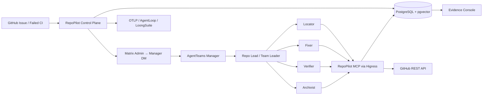

# Architecture

## Logical View



## AgentTeams Mapping

| Competition requirement | AgentTeams mechanism                         | RepoPilot implementation                       |
| ----------------------- | -------------------------------------------- | ---------------------------------------------- |
| Role orchestration      | Worker + Team CRD                            | five Worker resources                          |
| Task decomposition      | Team Leader project/task management          | Repo Lead + repository-triage                  |
| Context transfer        | Matrix Team Room + shared task files + MinIO | immutable source context and task deliverables |
| Collaborative execution | Leader delegates to Team Workers             | Locator → Fixer → Verifier → Archivist         |
| State tracking          | Project/task state + Worker/Team status      | AgentTeams status + RepoPilot Run state        |
| Human intervention      | Human in Matrix / control plane              | approval console                               |

## State Machine

```text
queued
  ├─> awaiting_dispatch ─> dispatched
  └─> dispatched

dispatched ─> running
running ─> awaiting_approval ─> running
running ─> verifying ─> succeeded

non-terminal states ─> failed/cancelled
```

Terminal states cannot transition.

## Data Model

- `runs`: source, policy, status, Matrix event, Trace ID.
- `steps`: Agent-level execution unit.
- `evidence`: append-only hash chain.
- `approvals`: optimistic version + one-time `consumed_at`.
- `runbooks`: full-text index and optional `vector(1536)`.

## Deployment Profiles

### Local development

- RepoPilot control plane and console on Node.js.
- PostgreSQL/pgvector in Docker.
- AgentTeams optional.
- No model secret required.

### Demo / competition

- AgentTeams v1.2.2 local Docker or Kubernetes.
- RepoPilot MCP behind Higress.
- GitHub token stored in gateway/secret manager.
- OpenTelemetry OTLP to AgentLoop/LoongSuite or compatible backend.

### Production

- Kubernetes.
- PostgreSQL or PolarDB for PostgreSQL.
- OIDC/SSO before control plane.
- HTTPS ingress.
- GitHub App rather than broad personal token.
- Restricted egress and repository allowlist.
